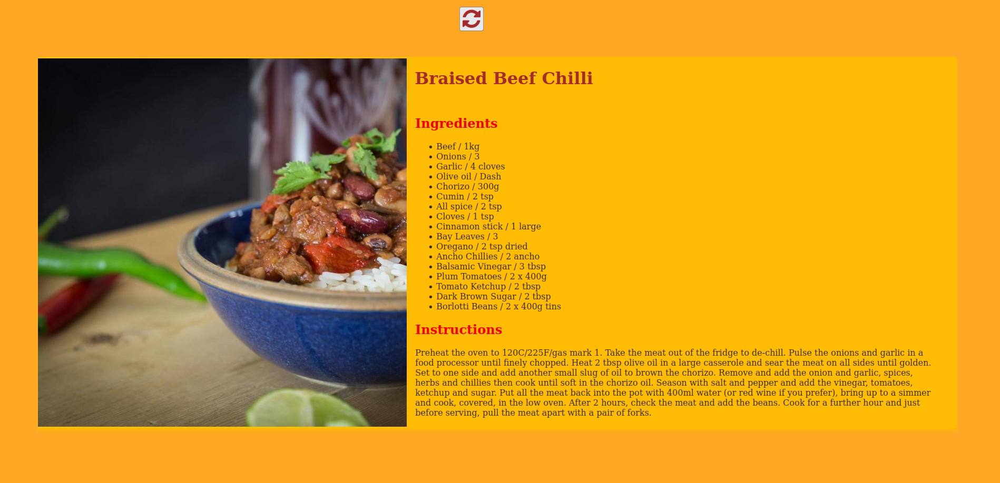

# A recipe app that will show the recipe of a meal

1. Check out the live demo from here https://shahir-abdullah.github.io/Random-Recipe-App/

2. I used a public api to fetch some data about a meal. And I used the data (recipe instructions, image, ingredients) and made a simple html webpage.

3. Created this app with HTML, CSS, Javascript

4. Used the public api https://www.themealdb.com/api.php
